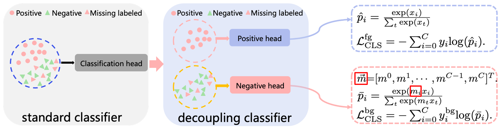

## Introduction

This repository is a official PyTorch implementation of [Decoupling Classifier for Boosting Few-shot Object Detection and Instance Segmentation](https://openreview.net/pdf?id=dVXO3Orjmxk) (NeurIPS 2022). This repo is created by Bin-Bin Gao.

	
[](https://paperswithcode.com/sota/few-shot-object-detection-on-ms-coco-1-shot?p=decoupling-classifier-for-boosting-few-shot)	
[](https://paperswithcode.com/sota/few-shot-object-detection-on-ms-coco-10-shot?p=decoupling-classifier-for-boosting-few-shot)
[](https://paperswithcode.com/sota/few-shot-object-detection-on-ms-coco-30-shot?p=decoupling-classifier-for-boosting-few-shot)


<div align="center"></div>

## Training and Evaluation
* To reproduce the FSOD/gFSOD results on COCO
  ```angular2html
  bash run_coco_fsod.sh r101 dcfs 8
  ```
* To reproduce the FSIS/gFSIS results on COCO
  ```angular2html
  bash run_coco_fsis.sh r101 dcfs 8
  ```

## Results on COCO Benchmark
* Few-shot Object Detection

  |Method| | | mAP<sup>novel</sup> | | | |
  |:---:|:---:|:---:|:---:|:---:|:---:|:---:|
  | Shot |  1  |  2  |  3  |  5  |  10 |  30 |
  |[DeFRCN*](https://openaccess.thecvf.com/content/ICCV2021/papers/Qiao_DeFRCN_Decoupled_Faster_R-CNN_for_Few-Shot_Object_Detection_ICCV_2021_paper.pdf) |7.7|11.4|13.3|15.5|18.5|22.5|
  |[DCFS](https://openreview.net/pdf?id=dVXO3Orjmxk)  |**8.1**|**12.1**|**14.4**|**16.6**|**19.5**|**22.7**|
  
* Generalized Few-shot Object Detection

  |Method| | | mAP<sup>novel</sup> | | | |
  |:---:|:---:|:---:|:---:|:---:|:---:|:---:|
  | Shot |  1  |  2  |  3  |  5  |  10 |  30 |
  |[DeFRCN](https://openaccess.thecvf.com/content/ICCV2021/papers/Qiao_DeFRCN_Decoupled_Faster_R-CNN_for_Few-Shot_Object_Detection_ICCV_2021_paper.pdf) |4.8|8.5|10.7|13.6|16.8|21.2|
  |[DCFS](https://openreview.net/pdf?id=dVXO3Orjmxk)  |**6.2**|**10.4**|**12.9**|**15.7**|**18.3**|**21.9**| 

  |Method| | | mAP<sup>Base</sup> | | | |
  |:---:|:---:|:---:|:---:|:---:|:---:|:---:|
  | Shot |  1  |  2  |  3  |  5  |  10 |  30 |
  |[DeFRCN](https://openaccess.thecvf.com/content/ICCV2021/papers/Qiao_DeFRCN_Decoupled_Faster_R-CNN_for_Few-Shot_Object_Detection_ICCV_2021_paper.pdf) |30.4|31.4|32.1|32.6|34.0|34.8|
  |[DCFS](https://openreview.net/pdf?id=dVXO3Orjmxk)  |**34.4**|**34.7**|**34.9**|**35.0**|**35.7**|**35.8**| 


* Few-shot Instance Segmentation

  |Method| | | mAP<sup>novel</sup>| | | |
  |:---:|:---:|:---:|:---:|:---:|:---:|:---:|
  | Shot |  1  |  2  |  3  |  5  |  10 |  30 |
  |[Mask-DeFRCN](https://openaccess.thecvf.com/content/ICCV2021/papers/Qiao_DeFRCN_Decoupled_Faster_R-CNN_for_Few-Shot_Object_Detection_ICCV_2021_paper.pdf) |6.7|9.5|11.0|12.7|15.4|18.3|
  |[DCFS](https://openreview.net/pdf?id=dVXO3Orjmxk)  |**7.2**|**10.3**|**13.5**|**15.7**|**15.9**|18.3|

* Generalized Few-shot Instance Segmentation

  |Method| | | mAP<sup>novel</sup> | | | |
  |:---:|:---:|:---:|:---:|:---:|:---:|:---:|
  | Shot |  1  |  2  |  3  |  5  |  10 |  30 |
  |[Mask-DeFRCN*](https://openaccess.thecvf.com/content/ICCV2021/papers/Qiao_DeFRCN_Decoupled_Faster_R-CNN_for_Few-Shot_Object_Detection_ICCV_2021_paper.pdf) |4.5|7.5|9.5|11.6|14.3|17.6|
  |[DCFS](https://openreview.net/pdf?id=dVXO3Orjmxk)  |**5.7**|**9.4**|**11.5**|**13.5**|**15.7**|**18.3**|

  |Method| | | mAP<sup>base</sup> | | | |
  |:---:|:---:|:---:|:---:|:---:|:---:|:---:|
  | Shot |  1  |  2  |  3  |  5  |  10 |  30 |
  |[Mask-DeFRCN*](https://openaccess.thecvf.com/content/ICCV2021/papers/Qiao_DeFRCN_Decoupled_Faster_R-CNN_for_Few-Shot_Object_Detection_ICCV_2021_paper.pdf) |24.6|25.6|26.2|26.8|28.2|29.1|
  |[DCFS](https://openreview.net/pdf?id=dVXO3Orjmxk)  |**28.0**|**28.5**|**28.9**|**29.1**|**29.9**|**30.3**| 

  
- Please refer to [DeFRCN](https://github.com/er-muyue/DeFRCN) for data peparation and installation details.
- \* indicates that the results are reproduced by us with the DeFRCN source code.
- The results of mAP<sup>base</sup> and mAP<sup>all</sup> for gFSOD and gFSIS can be seen at the [Supplementary Material](https://openreview.net/attachment?id=dVXO3Orjmxk&name=supplementary_material) and [ProjectPage](https://csgaobb.github.io/Projects/DCFS).

## Visualization Results 
The baseline DeFRCN may tend to incorrectly recognize positive object as background (middle two rows) due to the biased classification. This problem is greatly alleviated using our proposed method (DCFS).
<div align="center"></div>

## Citing
If you find this code useful in your research, please consider citing us:
```
@inproceedings{gao2022dcfs,
	title={Decoupling Classifier for Boosting Few-shot Object Detection and Instance Segmentation},
	author={Gao, Bin-Bin and Chen, Xiaochen and Huang, Zhongyi and Nie, Congchong and Liu, Jun and Lai, Jinxiang and Jiang, Guannan and Wang, Xi and Wang, Chengjie},
	booktitle={Thirty-sixth Conference on Neural Information Processing Systems (NeurIPS 2022)},
	pages={--},
	year={2022}
	}  
```

## Acknowledgement
This repo is developed based on [DeFRCN](https://github.com/er-muyue/DeFRCN) and [Detectron2](https://github.com/facebookresearch/detectron2). 
